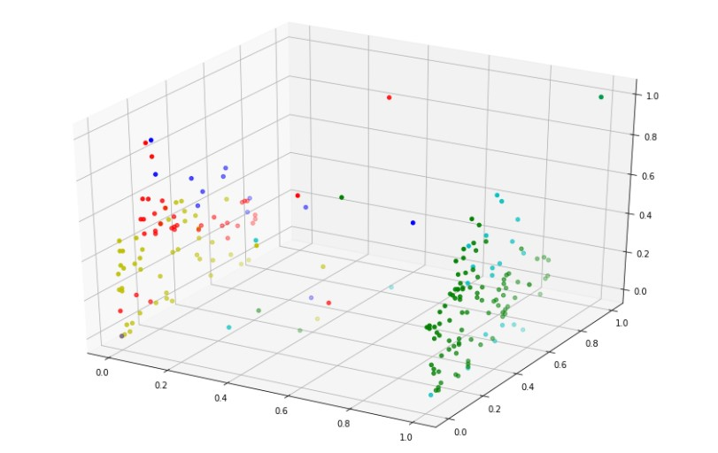

# Mall Customer Segmentation using K-means clustering

This project is a **numpy** implementation of [K-MEANS-CLUSTERING](#k-means-algorithm) which is a method of vector quantization, that aims to partition n observations into k clusters in which each observation belongs to the cluster with the nearest mean (cluster centers or cluster centroid)

## data 
worked on a data set that includes customers ( gender, age, annual income, and spending score ) and after grouping them into 5 different groups I  also made a function that predicts the spending score of any new customer by knowing which cluster he belongs to.
## k-means-algorithm
A simple algorithm that takes data and does the following :

- we initialise K centroids for each group by placing centroids in random locations in the space  and then iteratively do the following :
  
  - run through our data set and for each	individual.
  - find the nearest centroid to that individual by computing the distance between the data point and the centroid.
  - pick the cluster which has the minimum distance.

  - take all the average of all the data points in each cluster.
  - assign this value to be the new centroid of this cluster.
  - we simply loop over and over until the value of all centroids remain the same.
  
after this we will have K clusters.

  

 
